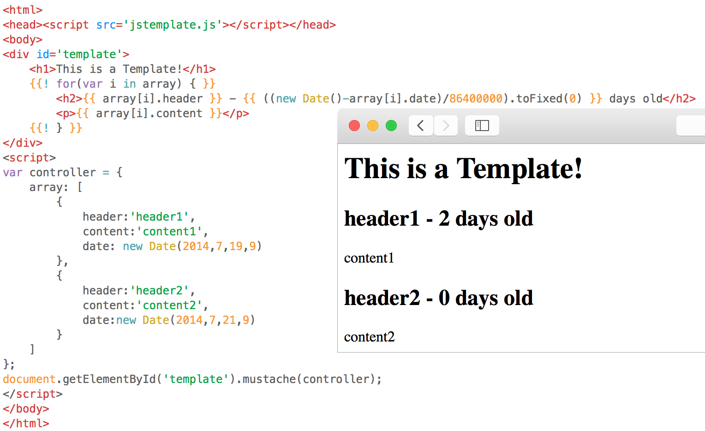

#JSTemplate
###Templating in just 10 lines

Add these ten lines (in jstemplate.js) of pure javascript to turn the {{ moustaches }} in your template to corresponding javascript output.

Use `{{! ... }}` for multi-line statements (e.g. `for`,`if`,etc). See the example to learn more!

###Installation:
download the ZIP repository, rename the folder removing '-master', and use the .tmbundle extension

###Usage:
To run the template script on an element e, use `e.moustache(controller)`, where `controller` is an optional object referenced in all embedded javascript. 
